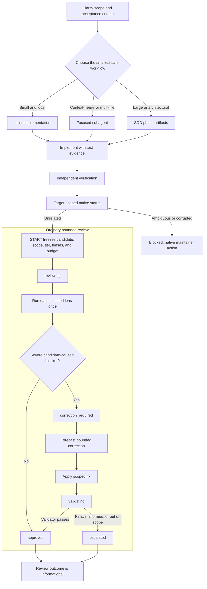

# Shevanio AI for Shevanio Pi

[](LICENSE)
[](https://github.com/Shevanio/shevanio-pi/stargazers)
[](#sddopenspec-flow)
[](#what-it-adds)

**Shevanio AI, delivered through the Shevanio Pi controlled development harness for Pi.**

Shevanio AI is the parent/product identity. Shevanio Pi (`shevanio-pi`) is the package/runtime harness and ecosystem configurator that provides a structured operating layer for Spec-Driven Development, focused subagents, strict TDD evidence, reviewable work units, safety guards, project/user skill discovery, and bounded native review.

Pi already has strong tools. Shevanio Pi adds workflow discipline, keeps review evidence Git-derived instead of agent narration, and leaves delivery decisions to ordinary repository policy.

The canonical repository for the Shevanio Pi package is [Shevanio/shevanio-pi](https://github.com/Shevanio/shevanio-pi).

> **Publication status:** `shevanio-pi` is not yet available from npm. Canonical npm installation commands will be documented only after publication is independently verified.

> **Transitional compatibility identifiers:** `GENTLE_PI_*`, `.pi/gentle-ai`, `.gentle-ai/`, `gentle-ai` installer/binary names, and `gentle-pi.*` schema names remain compatibility surfaces; they are not canonical package or repository coordinates.
>
> **Deprecated command aliases:** `/gentle:background-subagents`, `/gentle:banner`, `/gentle:banner-color`, `/gentle:dev-binary`, `/gentle:doctor`, `/gentle:install-sdd`, `/gentle:models`, `/gentle:persona`, `/gentle:review-mode`, `/gentle:sdd-preflight`, `/gentle:status`, `/gentle:toggle-rose`, and `/gentle:toggle-text-logo` map suffix-for-suffix to `/shevanio-pi:*`. They remain visible through all `2.x` releases, warn on every invocation, and are removed together in `shevanio-pi` 3.0.0. No other alias namespace is supported.

## The problem

Most coding-agent sessions fail for operational reasons, not model reasons:

- the agent jumps into code before requirements are clear;
- architectural decisions disappear into chat history;
- one request quietly becomes a huge multi-area diff;
- tests run late, or not at all;
- reviewers get handed a wall of changes;
- subagents are available, but the parent session has no orchestration discipline;
- project skills exist, but the model forgets to load them.

`shevanio-pi` fixes the workflow around the agent.

## What it adds

| Capability                     | What it does                                                                                                                                  |
| ------------------------------ | --------------------------------------------------------------------------------------------------------------------------------------------- |
| **Configurable persona**       | Runs the Shevanio AI parent identity as a senior architect and teacher, not a generic chatbot. Spanish responses use Rioplatense voseo by default; neutral mode is saved globally with project overrides. |
| **Configurable startup intro** | Adds a startup presentation, compact runtime panel, color presets, and commands to hide or show the decorative parts.                       |
| **Work routing discipline**    | Small tasks stay inline. Context-heavy exploration can be delegated. Large or risky changes go through SDD/OpenSpec.                          |
| **SDD/OpenSpec assets**        | Installs phase agents and chains for `init`, `onboard`, `explore`, `proposal`, `spec`, `design`, `tasks`, `apply`, `verify`, `sync`, and `archive`. |
| **Lazy SDD preflight**         | Resolves SDD mode, artifact store, delivery strategy, and review budget once per session; prompts only when a choice is genuinely unresolved.              |
| **Subagent orchestration**     | Keeps one parent session responsible while child agents explore, implement, test, or review with focused context.                             |
| **Strict TDD support**         | When project config declares a test command, apply/verify phases must record RED → GREEN → TRIANGULATE → REFACTOR evidence.                   |
| **Reviewer protection**        | Surfaces review workload risk before a task turns into an oversized PR.                                                                       |
| **Per-agent model assignment** | Pi-native modal for assigning stronger or cheaper models to specific SDD/custom agents.                                                       |
| **Skill discovery registry**   | Maintains `.atl/skill-registry.md` from project and user skills so review/comment/PR workflows do not silently miss the right skill.          |
| **Skill creation workflow**    | Provides the `gentle-ai-skill-creator`/`gentle-ai-skill-improver` skills, `/skill-creation` prompt, and packaged style guide for LLM-first skills. |
| **Delivery skills**            | Includes issue-first PRs, chained PRs, work-unit commits, cognitive docs, comment writing, and Judgment Day review.                           |
| **Bounded native review**      | Freezes one candidate, dispatches only controller-selected lenses, and records native authority. Review outcomes are informational; delivery follows ordinary repository policy. |
| **Verified native runtime**    | Provisions the exact package-local Gentle AI v2.4.0 runtime: signed archives on Darwin/Linux and a Go SumDB-verified source build on Windows x64/arm64. It validates package-local integrity and rejects PATH, global, sibling, symlink, and mode fallbacks. |
| **Runtime safety**             | Blocks destructive shell commands, asks for confirmation for sensitive operations, and blocks direct read/write/edit access to sensitive paths. |

**Migration note:** Do not enable `pi-tool-cards` and `quiet-tools` together: Pi rejects duplicate `bash`, `read`, `edit`, and `write` registrations. Disable or remove the standalone package during migration; `shevanio-pi` does not alter user configuration or delete that repository.

## Installation status

`shevanio-pi` is not yet published on npm. Do not use or circulate a canonical npm install command until the package name, provenance, and registry artifact have been verified after publication.

For existing users only, `gentle-pi` is a transitional compatibility package. It is not the canonical product and is not a recommendation for new installations.

Recommended companion packages:

```bash
pi install npm:pi-subagents-j0k3r
pi install npm:pi-intercom
pi install npm:pi-web-access
pi install npm:pi-lens
pi install npm:@juicesharp/rpiv-todo
pi install npm:@juicesharp/rpiv-ask-user-question
```

When using a local source checkout, start Pi in a project:

```bash
pi
```

`shevanio-pi` provides SDD agents as global Pi runtime assets, not per-project setup. The first SDD flow in a session still runs a one-time SDD preflight for preferences; for natural-language requests, the configured persona decides when SDD is needed and runs the explicit preflight first.

## Quick start

```text
/shevanio-pi:status          Check package, SDD assets, OpenSpec, and global model config.
/shevanio-pi:doctor          Run read-only diagnostics for SDD assets, config, tools, and guards.
/shevanio-pi:sdd-preflight   Run or reuse the session SDD preflight explicitly.
/sdd-init                  Create or refresh openspec/config.yaml (openspec/both stores only).
/shevanio-pi:models             Assign global model/effort routing to SDD/custom agents.
/shevanio-pi:persona            Switch between shevanio-ai and neutral persona modes.
/shevanio-pi:background-subagents  Show or set the managed background-subagents policy, with its deciding source.
/shevanio-pi:banner             Configure startup rose, text logo, and color preset.
```

Typical flow:

1. Open Pi in your repo.
2. Run `/shevanio-pi:status`.
3. Run `/sdd-init` once per project, or when test/project capabilities change. This also runs the session SDD preflight.
4. For a substantial change, ask Pi to use SDD. Natural-language requests are classified by the parent agent, not by brittle runtime regexes.
5. Review the phase artifacts instead of trusting floating chat context.

## Core workflow

1. **Inspect a local checkout.** Open Pi in the target repository, then run `/shevanio-pi:status` or `/shevanio-pi:doctor`.
2. **Plan when risk justifies it.** Small work stays direct; substantial work uses SDD with Engram, OpenSpec, or both so requirements and decisions survive compaction.
3. **Build with evidence.** One focused writer implements the approved scope. When Strict TDD is available, apply and verify preserve RED → GREEN → TRIANGULATE → REFACTOR evidence.
4. **Use runtime-owned RDD when available.** Gentle AI supplies any runtime-specific review instructions; this package does not recreate a lifecycle in documentation or prompts.
5. **Deliver through ordinary repository policy.** Review and Judgment Day evidence is informational only; Pi never creates a delivery route, authorization, target rederivation, or receipt gate.

> **Trust what the system can derive, not what an agent claims.** Agents analyze the candidate. The package-local Gentle AI runtime owns scope, risk, findings, and review authority. Review outcomes inform delivery; ordinary repository policy decides delivery commands. Dangerous-command safety and destructive-review consent remain independent. See Gentle AI's [review authority threat model](https://github.com/Gentleman-Programming/gentle-ai/blob/main/docs/review-authority-threat-model.md) and [Chapter 21 — Verifiable Trust](https://the-amazing-gentleman-programming-book.vercel.app/en/book/Chapter21_Verifiable-Trust).

## How the harness decides what to do

`shevanio-pi` routes through the smallest safe workflow:

| Request shape                                                               | Harness                      |
| --------------------------------------------------------------------------- | ---------------------------- |
| Small, clear, local edit                                                    | Inline direct work.          |
| Unknown codebase area or context-heavy investigation                        | Focused subagent delegation. |
| Large, ambiguous, architectural, product-facing, or high-review-risk change | SDD/OpenSpec flow.           |

The goal is not ceremony. The goal is to avoid accidental chaos. Once a task stops being small, delegation is mandatory.

### Delegation triggers

`shevanio-pi` keeps the parent session thin and delegates at the narrowest useful point. When the Pi Subagents extension is installed, the preferred runtime is the `subagent_*` tool family because it runs the user's configured project/global subagent definitions and preserves history/background behavior. Use waiting/task mode when the parent must consume the result and continue the workflow; use background mode only for independent work where parent continuation is not required. If those tools are unavailable, the parent should fall back to Pi's native `Agent` tool or another available delegation mechanism. The requirement is delegation; the runtime is capability-dependent.

| Trigger                                                                                                                     | Required behavior                                                             |
| --------------------------------------------------------------------------------------------------------------------------- | ----------------------------------------------------------------------------- |
| Reading 4+ files to understand a flow                                                                                       | Launch `scout`, `context-builder`, or the closest read-only mapping subagent. |
| Touching 2+ non-trivial code files                                                                                          | Delegate one writer; do not continue inline unless delegation is unavailable. |
| Commit, push, or PR after code changes                                                                                      | Follow the loaded native instruction, or ordinary repository policy when none is supplied. |
| Wrong cwd, worktree/git accident, merge recovery, confusing test/env issue                                                  | Stop, preserve the affected scope, and investigate separately before resuming. |
| Long monolithic session with accumulating complexity, roughly 20 tool calls, 5 exploratory reads, or 2 non-mechanical edits | Pause and delegate the remaining work, or stop and explain the exact blocker. |

The intended balanced loop for a bounded bugfix is:

```text
parent git/status + clarify → one worker writes authorized fixes → focused verification → parent reports
```

`scout`/`context-builder` save parent context by compressing broad exploration. `worker` preserves a single writer thread. Any RDD-specific actor behavior belongs to the runtime instruction supplied by Gentle AI, not to this README.

### Review authority recovery and reset safety

The model-visible review tools are `shevanio_review`, `shevanio_review_capture`, and `shevanio_review_scope`. This is a hard cut: no `gentle_review*` aliases are registered, existing sessions must restart or reload extensions, and old transcripts are not rewritten.

Legacy pre-graph authority is never migrated. `shevanio_review inspect` reports an exact repository-bound destructive reset challenge for legacy corruption; after that fresh interactive authorization, RESET and RECOVER_LOCK route to the audited native `gentle-ai review reclaim` operation and RECOVER routes to native `gentle-ai review recover`, so every destructive transition is executed and audited by the native authority store. Native inputs the request did not carry return a `native-input-required` envelope instead of being invented. Existing graph-v1 ordinary lineages remain readable and gate-validatable but are read-only; Judgment Day remains mutable on graph-v1.

`shevanio_review abandon`, `quarantine-legacy`, and `reconcile-authority` remain explicit v2.1.11 maintenance routes. Pi derives and displays the published nine-line `gentle-ai.review-abandon-authorization/v2` binding only for a caller-specified compact lineage, revision, snapshot identity, and discarded-work summary (captured lens results, findings presence, evidence-record presence); the native CLI re-derives non-terminal compact-v2 eligibility and the exact discarded work before accepting it. Legacy quarantine accepts only `historical findings freeze changed unrelated transaction state` with disposition `quarantine-malformed-freeze-event` and uses its exact eight-line binding. Both require fresh interactive approval and fail closed headlessly.

`shevanio_review reconcile-authority` accepts one predecessor lineage and revision, one successor lineage and revision, an actor, and a reason. Pi derives the exact seven-line `gentle-ai.review-reconcile-authorization/v1` binding, or appends exactly `anomalies=unchanged_target,malformed_recovery_authorization` for the published dual anomaly in that order. Native code re-derives every anomaly; malformed bindings, changed revisions, unavailable native support, cancellation, and native refusal fail closed through typed envelopes.

Reconciliation is intentionally narrow: native code may quarantine only the bound invalid compact-v2 recovery successor and persists the returned audit record; the predecessor stays untouched. Pi never recreates the retired `prepare-supersession`/`supersede` authority writer and never falls back to RESET or RECOVER.

`shevanio_review repair-legacy-alias` is the sole v2.1.11 route for `unsupported historical v1 operation alias`. The model supplies only lineage, actor, and reason. Pi freshly reads the native inventory, derives the canonical repository, exact legacy revision, fixed diagnostic, and fixed `quarantine-approved-historical-alias` disposition, displays the LF-only eight-line binding, and requires a new interactive approval. Native re-derives eligibility and quarantines rather than rewriting or validating the historical chain.

`review dispose-result` is deliberately unsupported by Pi pending a separate design; it has no controller operation or fallback. All maintenance routes fail closed headlessly and never auto-run against legacy history.

Native lifecycle status remains informational. VALIDATE does not authorize delivery; commit, push, PR, and release commands follow ordinary repository policy. Recovery grants no new budget, and legacy graph bundle export/import is retired.

### Review Lens Selection (architecture reference)

`reviewer` is not an installed subagent name. It is historical routing vocabulary, not a static instruction. When a runtime-specific Gentle AI instruction applies, it alone determines whether any concrete lens is used:

| Context | Review lens |
| --- | --- |
| Clear naming, structure, maintainability, small refactors | `review-readability` |
| Behavior, state, tests, determinism, regressions | `review-reliability` |
| Shell/process integration, partial failures, recovery, degraded dependencies | `review-resilience` |
| Security, permissions, data exposure/loss, architecture, dependencies | `review-risk` |
| Large PR, hot path, or >400 changed lines | Full 4R: `review-risk`, `review-resilience`, `review-readability`, `review-reliability` |

The former compact controller classified documentation/comment/formatting-only changes as zero-lens, standard changes as one dominant lens, and higher-risk paths as full 4R. This describes compatibility architecture only; never derive or run those choices from this README.

### Review authority architecture (reference only)

Gentle AI dynamically supplies runtime-specific RDD instructions. `shevanio-pi` does not define an RDD lifecycle, command route, approval path, recovery sequence, or fallback. The historical compact-controller material below documents architecture and compatibility boundaries only; it is not an operator instruction.



VALIDATE is informational. Commit, push, PR, and release commands follow ordinary repository policy; RDD never authorizes, rewrites, consumes review state for, or blocks them. Dangerous-command safety and destructive-review consent remain independent.

Native contract pairing is exact: this adapter resolves only the integrity-verified package-local Gentle AI v2.4.0 executable, independently hashes it, then negotiates `gentle-ai.review-integration/v2` outside the repository. Capabilities are cached by that executable digest. Every START, target status, FINALIZE, validate, and BIND-SDD request passes the same contract identifier. Negotiated envelopes decode exactly against the vendored schemas; `recover` routes only the provider-selected `action_disposition`, and optional additions require a future compatible schema/minor that the provider explicitly advertises and the consumer negotiates.

Contract `/v2` replaces the Base64 `candidate_diff` reviewer transport of `/v1` with immutable `base_tree`/`candidate_tree` plus an ordered `changed_path_manifest` and never an inline patch. `shevanio-pi` negotiates `/v2` only, with no dual-lane fallback; the cutover landed as one atomic commit against gentle-ai v2.2.2 (tracked by the `migrate-review-integration-v2` change), and the `/v1` schemas stay packaged because the `/v2` schemas `$ref` into their fragments. This provider contract version is unrelated to Pi's own internal "compact-v2" review-authority naming used below — the shared digit is coincidental, not a version pairing.

Target status owns `current_target`, `unrelated`, `ambiguous`, and `corrupted` applicability and returns one native action. Pi does not reconstruct ordinary authority from provider-private files or choose a lineage from repository-wide history. Restart recovery rebuilds only the derived candidate view from the native Git/content projection, including intended-untracked paths, symlinks, and immutable gitlink identities. Native failure envelopes retain their exact mutation outcome, replayability, required inputs, request digest, and next action. After an unknown or lost mutating result, Pi calls target status before any replay decision and returns only the provider-declared action.

Once the pinned gentle-ai runtime (currently v2.4.0) has written review authority, rollback MUST preserve every native store and receipt and MUST NOT run a downgraded binary against that repository. Disable the Pi route or roll forward to a compatible authority-aware release instead; deleting authority data or reinstalling an older binary is not a rollback path.

### FINALIZE wrapper input

`shevanio_review` accepts `input` as a JSON-serialized object string. For initial results, provide `review_result.lens_results[]`; each selected lens appears exactly once with `lens`, `findings`, and non-empty `evidence`. A clean lens uses `findings: []`. Pair `final_evidence` with exactly one of `final_verification_passed` or `final_verification_outcome`.

```json
{
  "review_result": {
    "lens_results": [
      {
        "lens": "review-reliability",
        "findings": [],
        "evidence": ["complete candidate reviewed"]
      }
    ]
  }
}
```

This is the Pi wrapper contract, not the native CLI file contract. The native command receives separate `--result`, `--refuter`, `--validation`, and `--evidence` files from the wrapper.

START derives the complete Git/untracked snapshot, lineage, persisted `low | medium | high` tier, zero/one/four lenses, authored changed lines, and correction budget `min(200, ceil(original_changed_lines / 2))`. Generated `testdata/golden/**` stays in snapshot identity but does not count as authored risk lines.

Every finding requires `evidence_class`, `causal_disposition`, and concrete changed-hunk, candidate-created-path, differential-test, or before/after proof. Missing IDs are assigned natively and selected-lens results are canonicalized deterministically.

Actor output is untrusted data and cannot authorize transitions, fixes, receipts, gates, or delivery.

Only severe `introduced`, `behavior-activated`, or `worsened` findings with valid proof enter correction IDs. `pre-existing` and `base-only` become follow-ups; `unknown`, insufficient, malformed, or inconclusive severe claims escalate. WARNING and SUGGESTION are informational.

Deterministic blockers need no refuter. Inferential blockers use exactly one complete read-only refuter batch.

Refuter proof may be independent concrete reproduction evidence; it does not need to duplicate reviewer `proof_refs`. Invalid, empty, malformed, missing, duplicate, unknown, or inconclusive refuter output escalates without a replacement refuter.

When native IDs are assigned to inferential findings, the first FINALIZE returns their canonical rows and a content-derived request hash without mutation; the second replays identical lens input with that hash and one complete refuter batch.

Ordinary permits one correction transaction within the original budget. FINALIZE requires a positive forecast before editing and derives actual correction lines from Git; one targeted validator and final verification close that transaction. Initial lenses are never rerun, while frozen findings and genesis scope remain unchanged.

The validator checks original criteria and correction regression only and cannot add scope or findings. Final evidence is hashed during FINALIZE, never at START.

Compact ordinary has five states: `reviewing`, `correction_required`, `validating`, `approved`, and `escalated`.

The validator cannot change claims, add findings, request fixes, launch actors, or request another attempt. A failed correction escalates instead of opening another review budget.

Compact authority uses content-derived CAS under the Git common directory. Exact retries are idempotent; stale/semantic retries, terminal mutation, and same-lineage graph-v1/compact-v2 ambiguity fail closed.

Trust boundary: The local orchestrator and same-user process are trusted to execute selected actors and submit their exact outputs. Native code owns scope, risk, IDs, canonicalization, state, receipts, and gates, and rejects malformed or inconsistent results structurally and causally. Malicious same-user host/process authenticity is a non-goal because that actor can replace the extension or mutate local authority; externally trusted attestation would require a separately privileged signer/service and is not claimed.

Ordinary ends only as `approved` or `escalated`.

Judgment Day starts only when explicitly requested and replaces ordinary review for that lineage.

Judgment Day starts with exactly two blind judges and zero refuters.

Judgment Day alone may iterate discovery and scoped re-judgment, for at most two rounds.

Findings surviving round two escalate; no third-round transition exists.

Native review mode and candidate-scoped consent remain provider-owned lifecycle semantics. Pi relays the exact provider-owned lifecycle inputs and outputs; it does not create a clone-local consent latch or infer a delivery decision.

Review outcomes and receipt state are informational; commit, push, pull-request, and release delivery follow ordinary repository policy. No one-shot command authorization, publication-target revalidation, or receipt gate is required for delivery, and Pi does not inspect RDD mode or native authority to decide a Bash delivery command.

Dangerous-command safety remains independent and authoritative. Destructive-review-maintenance consent remains separate from delivery. Review operations, informational VALIDATE, and SDD perform no commit, push, pull-request, release, or publication operation.

The Pi host relay bounds each locked-down reviewer subprocess by materialized prompt size rather than by one fixed number: a 15-minute floor plus 15 minutes per mebibyte of prompt, clamped to a 2-hour ceiling. Set `GENTLE_PI_REVIEW_RELAY_PI_TIMEOUT_MS` to a positive decimal to replace that derived bound with your own; malformed values are ignored and the same 2-hour ceiling still applies, so no configuration turns a foreground finalize into an unbounded child process. A reviewer killed by the bound reports `pi-host-relay-timeout` with the elapsed time and the limit it was measured against, and it explicitly does not ask you to relaunch the identical slot — that would re-spend the model tokens to reach the same wall. Reviewer results admitted earlier in the same finalize stay admitted and are not re-run.

Adversarial review roles (the refuter and the targeted validator) are never Pi-authored: the provider renders self-contained `review.capture-refuter` / `review.capture-validation` vectors and Go runs its own locked-down `pi` process on them. Package agent assets remain a package-managed isolated installation. Project and user overrides may shadow a package asset; `shevanio-pi` preserves those definitions and does not claim their effective permissions are package-compliant.

## SDD/OpenSpec flow

```text
init
  ↓
explore → research (optional) → proposal → spec ─┬→ design ─┐
                                                  └─────────┴→ tasks → apply → verify → sync → archive
```

The main loop is intentionally file-backed when you choose `openspec` or `both`:

```text
planning artifacts                implementation evidence        canonical update
──────────────────                ───────────────────────        ────────────────
proposal/spec/design/tasks   →    apply-progress/verify-report → sync-report → archive-report
```

For substantial work, the parent session coordinates the flow and each phase writes artifacts. That gives you:

- explicit requirements and non-goals;
- design decisions that survive compaction;
- task plans reviewers can reason about;
- implementation evidence;
- verification reports;
- sync reports that update canonical specs while keeping the change active;
- archive notes for future agents.

### OpenSpec artifact model

`shevanio-pi` treats OpenSpec-compatible behavior as part of the harness. You do not need to install the external OpenSpec CLI/package for SDD.

In file-backed modes, canonical accepted behavior lives in `openspec/specs/`, while active changes carry deltas under `openspec/changes/`:

```text
openspec/
├── specs/                                      # accepted source of truth
│   └── {domain}/spec.md
└── changes/
    ├── {change}/                              # active work
    │   ├── proposal.md
    │   ├── specs/{domain}/spec.md             # full spec or delta spec
    │   ├── design.md
    │   ├── tasks.md
    │   ├── apply-progress.md
    │   ├── verify-report.md
    │   └── sync-report.md
    └── archive/YYYY-MM-DD-{change}/           # immutable audit trail
```

Delta flow:

```text
openspec/changes/{change}/specs/{domain}/spec.md
        │
        │  sdd-sync applies ADDED / MODIFIED / REMOVED
        ▼
openspec/specs/{domain}/spec.md
        │
        │  sdd-archive moves the completed change folder
        ▼
openspec/changes/archive/YYYY-MM-DD-{change}/
```

When a canonical spec already exists, change specs use requirement operation sections:

```markdown
## ADDED Requirements

## MODIFIED Requirements

## REMOVED Requirements
```

`MODIFIED` requirements must include the full requirement block, including still-valid scenarios, because sync replaces the canonical block by requirement name. `sdd-sync` syncs file-backed deltas into `openspec/specs/{domain}/spec.md` while keeping the change active; `sdd-archive` then moves the synced change to `openspec/changes/archive/YYYY-MM-DD-{change}/`.

Engram-only mode is different by design: Engram is working memory and does not maintain a canonical spec merge layer. Use `openspec` or `both` (hybrid file + memory persistence) when you need canonical spec evolution.

## SDD preflight and project files

`shevanio-pi` does not require SDD agents to be copied into every project. The package ensures global Pi SDD assets exist under the Pi agent home and treats project-local files only as overrides/debug copies. Slash SDD flows such as `/sdd-*`, `/sdd-init`, and the explicit `/shevanio-pi:sdd-preflight` command run a lazy preflight and resolve session-scoped SDD preferences. For natural-language requests, the parent agent decides whether the work should use SDD and must run/reuse `/shevanio-pi:sdd-preflight` before continuing.

```text
~/.pi/agent/agents/sdd-*.md
~/.pi/agent/chains/sdd-*.chain.md
~/.pi/agent/gentle-ai/support/strict-tdd*.md
```

Preflight values resolve in this order: explicit current user/session choice, valid persisted preference, capability or already-selected strategy constraint, canonical default, then a prompt only when genuinely unresolved. Resolved values are reused for later SDD flows in the session.

Canonical values are `auto` execution mode, `openspec` artifact store, `ask-on-risk` delivery strategy, and a `400` changed-line review threshold. The delivery strategy domain is `ask-on-risk`, `auto-chain`, `single-pr`, or `exception-ok`; `chain_strategy` remains deferred until chaining is selected. `exception-ok` requires explicit `size:exception` acceptance and is never inferred. Consent, authorization, security, destructive/publishing, interactive phase approval, and ambiguous-scope gates remain human-controlled.

It does **not** overwrite existing global assets unless you explicitly run:

```text
/shevanio-pi:install-sdd --force
```

Manual preflight command:

```text
/shevanio-pi:sdd-preflight
```

## Skill registry

`shevanio-pi` keeps a local registry at:

```text
.atl/skill-registry.md
```

The registry scans project and user skill roots, not package-owned skills. It exists to catch workflow skills that are present on disk but not visible in Pi's injected skill list.

It scans common roots such as:

```text
./skills
.opencode/skills
.claude/skills
.gemini/skills
.cursor/skills
.github/skills
.codex/skills
.qwen/skills
.kiro/skills
.openclaw/skills
.pi/skills
.agent/skills
.agents/skills
.atl/skills
~/.pi/agent/skills
~/.config/agents/skills
~/.agents/skills
~/.kimi/skills
~/.config/opencode/skills
~/.config/kilo/skills
~/.claude/skills
~/.gemini/skills
~/.gemini/antigravity/skills
~/.cursor/skills
~/.copilot/skills
~/.codex/skills
~/.codeium/windsurf/skills
~/.qwen/skills
~/.kiro/skills
~/.openclaw/skills
```

Behavior:

- `.atl/` is added to `.gitignore` when needed;
- the registry refreshes on session start;
- startup refresh is skipped when Pi starts with `--no-skills` / `-ns`, `--no-skill-registry`, or `GENTLE_PI_NO_SKILL_REGISTRY=1`;
- `/skill-registry:refresh` forces regeneration;
- a best-effort watcher refreshes when skill files change;
- the registry indexes skill names, full descriptions, scope, and exact `SKILL.md` paths without copying skill body rules.

Skill discovery is a guardrail, not a workflow router: it helps Pi load the right skill without forcing extra ceremony.

`shevanio-pi` also ships package-owned `gentle-ai-skill-creator` and `gentle-ai-skill-improver` skills plus the `/skill-creation` prompt for creating or updating project skills. Both skills use `docs/skill-style-guide.md` as their normative style contract. The workflow checks for duplicates, keeps `SKILL.md` concise, uses one-line trigger-rich frontmatter, and reminds maintainers to refresh the registry after skill changes.

Packaged skills include `cognitive-doc-design`, `comment-writer`, `gentle-ai-judgment-day`, `gentle-ai-skill-creator`, `gentle-ai-skill-improver`, and the other delivery/review skills under `skills/`. SDD init is installed as the packaged `sdd-init` runtime agent under `assets/agents/` and refreshed with the SDD assets.

Compatibility: the package keeps the existing skill folders (`skills/branch-pr`, `skills/cognitive-doc-design`, `skills/comment-writer`, `skills/judgment-day`, `skills/skill-creator`, `skills/skill-registry`, and `skills/work-unit-commits`) but their exported frontmatter names are prefixed to avoid collisions with user/global skills. Treat former package names such as `branch-pr`, `cognitive-doc-design`, `comment-writer`, `judgment-day`, `skill-creator`, `skill-registry`, and `work-unit-commits` as legacy aliases in prose; runtime skill selection should use `gentle-ai-branch-pr`, `gentle-ai-cognitive-doc-design`, `gentle-ai-comment-writer`, `gentle-ai-judgment-day`, `gentle-ai-skill-creator`, `gentle-ai-skill-registry`, and `gentle-ai-work-unit-commits`.

Delegation contract:

- parent/orchestrator resolves project/user skills from the registry and passes matching paths under `## Skills to load before work`;
- SDD subagents still use their assigned executor/phase skill;
- during normal runtime, subagents should not independently discover additional project/user `SKILL.md` files or the registry;
- fallback loading is degraded self-healing and must be reported via `skill_resolution` as `fallback-registry`, `fallback-path`, or `none`.

## Persona modes

```text
/shevanio-pi:persona
```

| Persona     | Behavior                                                                                                      |
| ----------- | ------------------------------------------------------------------------------------------------------------- |
| `shevanio-ai` | Senior architect, teacher, direct technical feedback, Rioplatense Spanish/voseo when the user writes Spanish. |
| `neutral`   | Same discipline, warmer professional language, no regional expression.                                        |

Persona authority uses this precedence:

1. `.pi/shevanio-pi/persona.json` (project canonical)
2. `.pi/gentle-ai/persona.json` (project legacy)
3. `${SHEVANIO_PI_CONFIG_HOME:-~/.pi/shevanio-pi}/persona.json` (global canonical)
4. `${GENTLE_PI_CONFIG_HOME:-~/.pi/gentle-ai}/persona.json` (global legacy)
5. built-in `shevanio-ai` mode

Canonical files contain only the schema and mode:

```json
{
  "schema": "shevanio-pi.persona/v1",
  "mode": "shevanio-ai"
}
```

The canonical modes and picker options are `shevanio-ai` and `neutral`. `/shevanio-pi:persona` and `/shevanio-pi:persona global` write only the canonical global target. `/shevanio-pi:persona project` writes only the canonical project file.

Legacy unversioned files accept `gentleman` (normalized to `shevanio-ai`) or `neutral` and are never rewritten. `gentleman` is read compatibility only and is never offered by the picker or emitted as the current mode. A present malformed or unreadable winning file fails closed to the built-in `shevanio-ai` mode without falling through. Distinct same-scope canonical and legacy files report whether their normalized values match or conflict. Run `/reload` or start a new Pi session after switching persona.

## Model and effort assignment

```text
/shevanio-pi:models
```

The modal discovers:

- project agents in `.pi/subagents/`, `.pi/agents/`, and `.agents/`;
- user agents in `~/.pi/agent/subagents/`, `~/.pi/agent/agents/`, and `~/.agents/`;
- built-in agents from `pi-subagents-j0k3r` when present.

When applying routing, project agents write runtime profiles to `.pi/subagents.json`; global and built-in agents write profiles to `~/.pi/agent/subagents.json`.

Recommended model/effort shape:

| Agent kind                 | Recommended model                                    | Recommended effort (`thinking`) |
| -------------------------- | ---------------------------------------------------- | ------------------------------- |
| Explore, proposal, archive | Fast and cheap is usually enough.                    | `off` to `low`                  |
| Spec, design, tasks        | Strong reasoning model.                              | `medium` to `high`              |
| Apply                      | Strong coding and tool-use model.                    | `medium` to `high`              |
| Verify / review            | Strong fresh-context model.                          | `high`                          |
| Tiny utilities             | Inherit active/default model unless they bottleneck. | `inherit`                       |

Saved globally at:

```text
~/.pi/gentle-ai/models.json
```

Existing project-local `.pi/gentle-ai/models.json` files are still read as a legacy fallback when no global model config exists, but `/shevanio-pi:models` writes the shared global config.

Inside `/shevanio-pi:models`, press `x` to export the saved routing to `~/.pi/gentle-ai/models.export.json`, or `r` to restore from that file after confirmation. Export uses a versioned envelope and restore writes the normal `models.json` shape before applying routing to agents.

Config shape (per agent):

```json
{
  "sdd-design": {
    "model": "anthropic/claude-sonnet-4",
    "thinking": "high"
  },
  "sdd-archive": {
    "model": "openai/gpt-5-mini"
  }
}
```

Legacy string entries are still accepted and treated as `model`-only config.

## Commands

| Command                          | What it does                                                        |
| -------------------------------- | ------------------------------------------------------------------- |
| `/shevanio-pi:status`              | Shows package, SDD asset, OpenSpec, and global model config status. |
| `/shevanio-pi:doctor`              | Runs read-only diagnostics for SDD assets, model/persona config, memory tools, and safety guards. |
| `/shevanio-pi:models`                 | Opens global model + effort assignment UI. Press `x` to export and `r` to restore saved routing. |
| `/shevanio-pi:persona`                | Switches global persona mode, with project override support.        |
| `/shevanio-pi:background-subagents`   | Shows or sets the managed background-subagents policy (`status\|enable\|disable`), naming the source that decided it. |
| `/shevanio-pi:banner`                 | Configures startup banner rose, text logo, and color preset.        |
| `/shevanio-pi:toggle-rose`            | Toggles the startup rose.                                           |
| `/shevanio-pi:toggle-text-logo`       | Toggles the startup text logo.                                      |
| `/shevanio-pi:banner-color`           | Selects a startup banner color preset.                              |
| `/sdd-init`                      | Initializes or refreshes `openspec/config.yaml` (openspec/both stores only). |
| `/shevanio-pi:install-sdd`         | Repairs missing global SDD runtime assets without overwriting files. |
| `/shevanio-pi:install-sdd --force` | Force-refreshes installed global SDD assets.                         |
| `/skill-registry:refresh`        | Regenerates `.atl/skill-registry.md`.                               |
| `/skill-creation`                | Creates or updates an LLM-first skill using the packaged `gentle-ai-skill-creator` contract and style guide. |

Package-owned global SDD runtime assets are also refreshed automatically on session start when `shevanio-pi` changes. Project-local `.pi/agents` and `.pi/chains` remain manual overrides and are never overwritten by startup refresh.

### Background subagents policy

Background delegation is off unless you turn it on. The policy is user-owned: only an explicit `/shevanio-pi:background-subagents enable` or `disable` writes it, and Pi automation never toggles it.

```text
/shevanio-pi:background-subagents           Report the effective policy, the deciding source, and the resolved capability.
/shevanio-pi:background-subagents enable    Write "on" to the global file.
/shevanio-pi:background-subagents disable   Write "off" to the global file.
```

Six configured sources can decide the policy, and the first hit wins. Project scope outranks identity generation, so a legacy project file beats a canonical global file:

| Priority | Source | Notes |
| -------- | ------ | ----- |
| 1 | `<cwd>/.pi/shevanio-pi/background-subagents.json` | Canonical project file. |
| 2 | `<cwd>/.pi/gentle-ai/background-subagents.json` | Legacy project file; read-only compatibility. |
| 3 | `${SHEVANIO_PI_CONFIG_HOME:-~/.pi/shevanio-pi}/background-subagents.json` | Canonical global file. |
| 4 | `${GENTLE_PI_CONFIG_HOME:-~/.pi/gentle-ai}/background-subagents.json` | Legacy global file; read-only compatibility. |
| 5 | `SHEVANIO_PI_BACKGROUND_SUBAGENTS` | Canonical env; exactly `on` or `off`. |
| 6 | `GENTLE_PI_BACKGROUND_SUBAGENTS` | Legacy env; exactly `on` or `off`. |
| 7 | Built-in default | `off`; invalid env values are inert and fall through. |

Reads strictly accept canonical schema `shevanio-pi.background-subagents/v1` and legacy schema `gentle-pi.background-subagents/v1`; unknown schemas and malformed shapes are rejected. A present malformed file is authoritative, fails closed to `off`, and never falls through. Reads never create, copy, move, rewrite, merge, or delete either tree.

`enable` and `disable` write only canonical JSON to `SHEVANIO_PI_CONFIG_HOME ?? GENTLE_PI_CONFIG_HOME ?? ~/.pi/shevanio-pi`; an explicit legacy selector chooses the location but not the payload schema. Status names the deciding source/path and same-scope shadowed source. Conflicting canonical/legacy values warn; equal duplicates are informational. If both selectors resolve to one path, it is read once without a false collision. A project file that outranks a global write is reported truthfully. Capability (`ready` or `absent`) separately reports whether `subagent_run` is callable.

### Startup banner configuration

Startup banner settings are global-only. The first present source wins:

1. `${SHEVANIO_PI_CONFIG_HOME:-~/.pi/shevanio-pi}/banner.json` (canonical)
2. `${GENTLE_PI_CONFIG_HOME:-~/.pi/gentle-ai}/banner.json` (legacy read compatibility)
3. Built-in defaults: `showRose=true`, `showTextLogo=true`, `color=pink`

The unversioned JSON shape remains those three fields. Bad JSON, unreadable files, arrays, and non-objects normalize to all defaults; missing or invalid managed fields use their field defaults, and unknown fields are ignored. A present canonical file remains authoritative after normalization and never falls through to legacy. Reads and session startup never create, copy, move, merge, rewrite, or delete either file.

When distinct canonical and legacy files both exist, diagnostics name the shadowed legacy path; different normalized values warn, while equal normalized values are informational. Selectors that normalize to one path are read once without a false collision.

Explicit banner commands write only normalized managed fields to `SHEVANIO_PI_CONFIG_HOME ?? GENTLE_PI_CONFIG_HOME ?? ~/.pi/shevanio-pi`. They resolve again after writing and warn instead of claiming success when a different canonical source still outranks that target. Supported color presets are `pink`, `cyan`, `yellow`, and `green`.

Startup flag:

```text
pi --no-skill-registry
```

Use it when you want skills available normally but do not want Shevanio Pi to refresh/watch `.atl/skill-registry.md` on startup. `pi -ns` / `pi --no-skills` also skip the registry startup work because Pi is already disabling skill loading.

## Included skills

- `gentle-ai` — harness discipline for controlled Pi work.
- `gentle-ai-branch-pr` — issue-first PR preparation.
- `gentle-ai-chained-pr` — split oversized changes into reviewable PR chains.
- `work-unit-commits` — commits as reviewable work units.
- `gentle-ai-judgment-day` — blind dual review, fixes, and re-judgment.
- `cognitive-doc-design` — documentation that reduces cognitive load.
- `comment-writer` — concise, warm, postable collaboration comments.
- `gentle-ai-issue-creation` — issue workflow with checks before creation.
- `gentle-ai-skill-creator` — create LLM-first skills with valid frontmatter.
- `gentle-ai-skill-improver` — audit and upgrade existing LLM-first skills.

## Memory

`shevanio-pi` does **not** provide persistent memory by itself and does not currently advertise a canonical memory package. When compatible memory tools are independently installed and active, they can retain decisions, bug fixes, discoveries, user prompts, and session summaries across Pi sessions.

Memory contract for SDD delegation:

- parent/orchestrator owns memory retrieval and passes selected context into subagent prompts;
- subagents should not independently search memory during normal runtime unless explicitly instructed to retrieve a specific artifact or observation;
- subagents should save significant discoveries, decisions, bug fixes, and completed SDD phase artifacts before returning when memory tools are available;
- in memory/hybrid mode, SDD artifacts use stable topic keys such as `sdd/<change>/proposal`, `sdd/<change>/spec`, `sdd/<change>/design`, `sdd/<change>/tasks`, `sdd/<change>/apply-progress`, and `sdd/<change>/verify-report`.

## Package contents

| Path                           | Purpose                                                                                                    |
| ------------------------------ | ---------------------------------------------------------------------------------------------------------- |
| `extensions/gentle-ai.ts`      | Injects the Shevanio AI parent identity, orchestrates native review authority, refreshes global SDD assets, registers commands, applies model/persona config, and enforces runtime safety. |
| `lib/native-review-cli.ts`     | Strict package-local adapter for Gentle AI START, FINALIZE, VALIDATE, SDD binding, and status contracts.     |
| `lib/review-integration-v2.ts` | Strict consumer decoder for negotiated capabilities, operations, target status, projections, repair, and failures against contract `review-integration/v2` (active today).  |
| `lib/review-candidate-view.ts` | Builds immutable changed-scope actor views while preserving full-tree, path, mode, symlink, and index integrity. |
| `lib/review-canonical.ts`      | Permanent Pi-owned canonical JSON and domain-hash primitives for consumer-side identities.                   |
| `lib/review-repository.ts`     | Permanent Pi-owned Git common-directory identity, safe Git environment, and authority-root binding.          |
| `lib/gentle-ai-binary.ts`      | Resolves and verifies the confined package-local Gentle AI runtime without global or PATH fallback.          |
| `scripts/gentle-ai-installer.mjs` | Installs signed Darwin/Linux archives or exact Go SumDB-verified Windows source builds into the package-local runtime. |
| `contracts/review-integration/v1/` | Byte-identical provider schemas and conformance fixtures for contract `review-integration/v1`, hash-checked before packaging; retained on disk permanently because `/v2`'s schemas `$ref` into these fragments. |
| `contracts/review-integration/v2/` | Byte-identical provider schemas and conformance fixtures for contract `review-integration/v2` (immutable `base_tree`/`candidate_tree`, ordered `changed_path_manifest`, no inline candidate diff), hash-checked before packaging. |
| `extensions/startup-banner.ts` | Shows and configures the startup intro, color presets, compact runtime panel, and collaboration credit.     |
| `extensions/sdd-init.ts`       | Registers `/sdd-init` for OpenSpec initialization.                                                         |
| `extensions/skill-registry.ts` | Maintains `.atl/skill-registry.md` from project/user skills and closes file watchers on shutdown.          |
| `assets/orchestrator.md`       | Parent-session orchestration contract (always-on core).                                                    |
| `assets/orchestrator-delegation.md` | Lazy-loaded delegation/routing/review detail, including the mirrored gentle-ai canon.                 |
| `assets/orchestrator-memory.md` | Lazy-loaded SDD memory phase table, artifact keys, and lifecycle rule.                                    |
| `assets/orchestrator-skills.md` | Lazy-loaded skill registry fallback semantics and intent-driven skill discovery.                          |
| `assets/sdd-orchestrator-workflow.md` | Lazy-loaded SDD workflow surface for the parent orchestrator.                                       |
| `assets/agents/`               | SDD agents installed as global Pi runtime assets.                                                          |
| `assets/chains/`               | SDD chains installed as global Pi runtime assets.                                                          |
| `assets/support/`              | Strict TDD support docs for apply/verify phases.                                                           |
| `skills/`                      | Shevanio Pi delivery and collaboration skills.                                                              |
| `prompts/`                     | The `/skill-creation` prompt template.                                                                     |
| `docs/skill-style-guide.md`    | Normative style guide used by the packaged skill creation/improvement skills.                              |
| `docs/native-authority-architecture.md` | Post-U8 ownership boundary, reproducible slimming metrics, Windows evidence, exact #191 seam, and the `review-integration/v1`→`v2` migration status, including the "compact-v2" naming disambiguation.     |
| `docs/review-integration.md`   | Negotiated provider/consumer contract and the current shevanio-pi adoption boundary.                       |

## Development

Install from this repo:

```bash
pi install .
```

Validate before publishing:

```bash
pnpm test
bun build extensions/skill-registry.ts --target=node --format=esm --outfile=/tmp/skill-registry.js
node --experimental-strip-types --check extensions/gentle-ai.ts
node --experimental-strip-types --check extensions/sdd-init.ts
node --experimental-strip-types --check extensions/startup-banner.ts
npm pack --dry-run
```

### Running the cross-lane battery

The cross-lane battery (`tests/crosslane/cross-lane.mjs`) validates the adapter against a real `gentle-ai` binary, end to end and out of CI on purpose. The pinned decoder lane only ever sees vendored fixtures, so new envelope schemas and full controller sequencing are never driven through a live lifecycle before merge; the battery closes that gap.

```bash
pnpm test:cross-lane                # requires the dev-binary override
pnpm test:cross-lane --with-model   # adds the real Go-owned pi reviewer run (model spend)
```

What it checks, against live scratch repositories:

- a low-risk lifecycle: START → native-approved FINALIZE → terminal burn; the `pre-commit` gate is informational and unmanaged, not an allow decision or retained receipt;
- the medium-risk `consent/v3` granted round-trip through the direct decoder lane;
- controller sequencing: each decoded offered next step equals the native transition; correction evidence precedes Go-owned targeted validation, then native approval and terminal burn leave no retained receipt;
- the active audited abandon end to end, asserting the adapter builds the exact nine-line `gentle-ai.review-abandon-authorization/v2` discarded-work binding and the native gate commits the quarantine record;
- after a scope change, a burned approved predecessor exposes no recoverable authority; recovered-successor hydration remains covered at unit level;
- forward-decoder freshness: every live envelope captured from the binary must decode without unknown-key rejection, the early warning that gentle-ai main grew a field gentle-pi lacks;
- the default no-model lane: 13 of 14 checks pass while the real-model check is intentionally skipped; Go-owned validation uses a deterministic scratch fake `pi`, and only `--with-model` runs the real locked-down reviewer with model spend.

Prerequisites:

- A real `gentle-ai` binary selected through the dev-binary override; there is no PATH or pinned-binary fallback, and the battery refuses to run without one. Either export `GENTLE_PI_GENTLE_AI_DEV_BINARY=<absolute path>` for the session, or register a persistent override with `/shevanio-pi:dev-binary <absolute path>` (stored at `~/.pi/gentle-ai/dev-binary.json` with schema `gentle-pi.dev-binary/v1`; the environment variable takes precedence over the registration, and the binary is re-validated and re-hashed on every resolution). Any real build works: an installed release binary or a locally built gentle-ai main.
- A Git checkout or worktree of this repository. The battery is a contributor tool wired to the repository layout and is excluded from `pnpm test` and CI by construction; run it from the repo, not from an installed Pi package.

The battery owns one throwaway scratch root under the OS temp directory and never touches the enclosing repository. Before any review lifecycle it creates private `HOME`, XDG config/cache/data/state, temporary, and RDD state directories inside that root; it proves RDD starts `off/default`, explicitly opts in with sandbox-global RDD, and removes the complete root after the run. It never requires or changes the user's ambient RDD mode. The default run spends no model tokens; `--with-model` launches one real reviewer model run and costs model spend.

It prints one PASS/FAIL/SKIP row per check plus a note, and exits non-zero when any check fails. A check blocked by a known upstream class is reported with a `known-red` prefix instead of being hidden; it remains a failure, not a success.

Running this battery against new gentle-ai builds (release candidates or main) and reporting red checks is a valuable contribution. The sibling provider-side battery lives at `scripts/cross-lane-battery.sh` in [Gentleman-Programming/gentle-ai](https://github.com/Gentleman-Programming/gentle-ai).

The manual publication workflow remains safety-gated. Do not dispatch it until canonical npm publication is explicitly approved and ready for independent verification:

```bash
version="$(node -p "require('./package.json').version")"
tag="v${version}"
git fetch --no-tags origin "refs/tags/${tag}"
test "$(git rev-parse 'FETCH_HEAD^{commit}')" = "$(git rev-parse "${tag}^{commit}")"
gh workflow run publish.yml \
  --repo Shevanio/shevanio-pi \
  --ref main \
  -f tag="${tag}"
gh run watch <run-id> --repo Shevanio/shevanio-pi --exit-status
npm view shevanio-pi@<version> version --registry=https://registry.npmjs.org/
npm dist-tag ls shevanio-pi --registry=https://registry.npmjs.org/
```

Do not run `npm publish` locally for `shevanio-pi`. Dispatch the trusted workflow definition only from protected default `main` and provide its sole `tag` input. The workflow requires an exact annotated `vSemVer` tag whose peeled commit, current remote `main`, dispatch/main workflow commit, checkout, and `package.json` version are identical. It rechecks remote tag and `main` immediately before publishing through OIDC with provenance and environment protection; an advanced `main` requires a new release version, never a moved tag.

## Principles

- Human control over agent momentum.
- Concepts before code.
- Artifacts over floating chat context.
- SDD when risk justifies it.
- Strict TDD when tests exist.
- One parent orchestrator, focused subagents.
- Reviewable changes over giant diffs.
